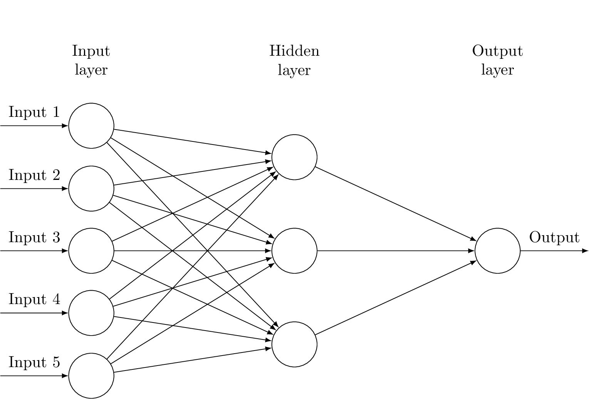

# n2

[![CI]][workflow]
[![Maintenance]][repo]

`n2` is a library implementation of a feedforward, backpropagation artificial neural network.

## Usage

Add the following to the `[dependencies]` section of your `Cargo.toml` file:

```toml
n2 = "0.1.0"
```

### Example

To create a network that looks like this:

<p align="center">
  
</p>

```rust
let network = NetworkBuilder::new()
    .input_layer::<5>()
    .hidden_layer::<3>()
    .output_layer::<1>()
    .build();
```

## License

Licensed under either of

- Apache License, Version 2.0 ([LICENSE-APACHE](LICENSE-APACHE) or 
  http://www.apache.org/licenses/LICENSE-2.0)
- MIT license ([LICENSE-MIT](LICENSE-MIT) or http://opensource.org/licenses/MIT)

at your option.

### Contribution

Unless you explicitly state otherwise, any contribution intentionally submitted for inclusion in the 
work by you, as defined in the Apache-2.0 license, shall be dual licensed as above, without any 
additional terms or conditions.

[CI]: https://github.com/nerosnm/n2/actions/workflows/ci.yml/badge.svg?branch=master
[workflow]: https://github.com/nerosnm/n2/actions/workflows/ci.yml
[Maintenance]: https://img.shields.io/badge/maintenance-actively--developed-brightgreen.svg
[repo]: https://github.com/nerosnm/n2
[ann-531]: ./images/ann-531.png
